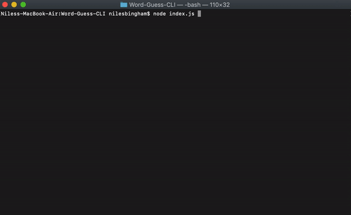
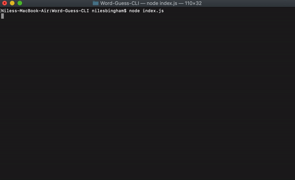

# 
Word-Guess-CLI

### App Visuals

Word Guessed Correctly

Word Not Guessed

## Overview

This is a quick word guess game using `Node.js` and `inquirer` npm to ask the user to input a letter to guess the stored word.

## How to use

Initialize the app by running `npm install` to download all the files needed. Start the game up by using `node index.js`.

- The game will start when the blank word is displayed and the user will be prompted to input a letter.
  - If the letter is guessed correctly then a message will appear and confirm it followed by the blank word with the letter filled into all appropriate positions. The sequence will then begin again with another prompt for another guess.
  - If the guess is incorrect a message will be displayed that the user guessed incorrectly. Another message will display the guesses remaining along with the blank or partially filled in word.
- After the user has either guessed all letters or the remaining guesses reaches zero a message will be displayed and the user will be prompted to either play again or not.
  - The default of the prompt is to end the game.
